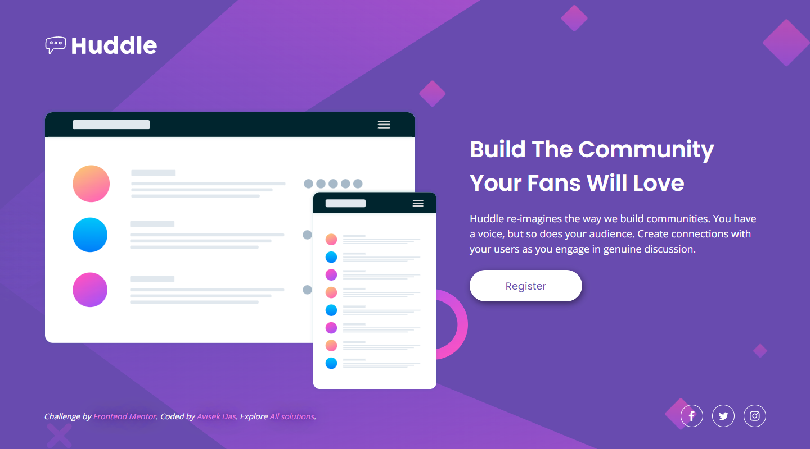

# Frontend Mentor - Huddle landing page with single introductory section solution

This is a solution to the [Huddle landing page with single introductory section challenge on Frontend Mentor](https://www.frontendmentor.io/challenges/huddle-landing-page-with-a-single-introductory-section-B_2Wvxgi0). Frontend Mentor challenges help you improve your coding skills by building realistic projects. 

## Table of contents

- [Overview](#overview)
  - [The challenge](#the-challenge)
  - [Screenshots](#screenshots)
  - [Links](#links)
- [My process](#my-process)
  - [Built with](#built-with)
  - [What I learned](#what-i-learned)
  - [Continued development](#continued-development)
- [Author](#author)

## Overview

### The challenge

Users should be able to:

- View the optimal layout for the page depending on their device's screen size
- See hover states for all interactive elements on the page

### Screenshots

<table>
  <tr>
    <td></td>
    <td></td>
  </tr>
</table>

### Links

- Solution URL: https://www.frontendmentor.io/solutions/huddle-landing-page-with-single-introductory-section-7_OVgUkPxV
- Live Site URL: https://avisek.github.io/frontend-mentor-solutions/huddle-landing-page-with-a-single-introductory-section

## My process

The project was very straightforward and easy. I began with a mobile-first approach and later implemented a media query to handle the desktop view. I added my own active and focus state styling for the buttons.

### Built with

- Semantic HTML5 markup
- CSS custom properties
- Flexbox
- Mobile-first workflow
- BEM
- SCSS

### What I learned

I have learned about the `aria-label` attribute. It is used in web development to provide an accessible label for an element that may not have a visible label. It is particularly important for users who rely on assistive technologies such as screen readers to navigate and interact with web content.

Here is a common use case for the `aria-label` attribute:

```html
<a class="Button" href="#" aria-label="Follow us on Facebook">
  <svg class="Icon Icon-facebook" xmlns="http://www.w3.org/2000/svg" viewBox="0 0 24 24">
    <!-- ... -->
  </svg>
</a>
```

### Continued development

In future projects, I would like to focus on improving the accessibility of my work by incorporating assistive technologies attributes and markups. This will help ensure that my work is accessible to a wider audience, including people with disabilities.

## Author

- GitHub - [@avisek](https://github.com/avisek)
- Frontend Mentor - [@avisek](https://www.frontendmentor.io/profile/avisek)
- LinkedIn - [@avisek-das](https://www.linkedin.com/in/avisek-das)
- Twitter - [@AvisekDs](https://www.twitter.com/AvisekDs)
